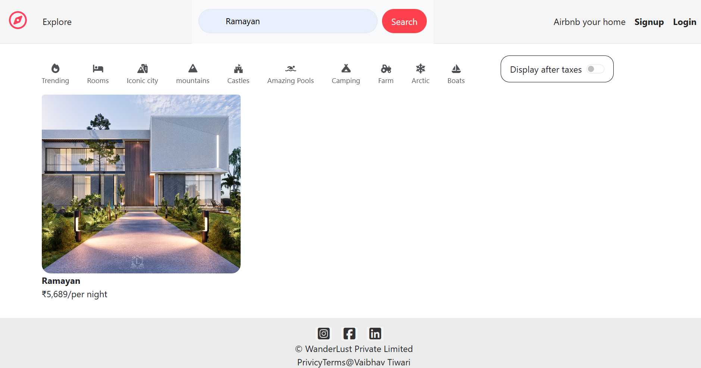
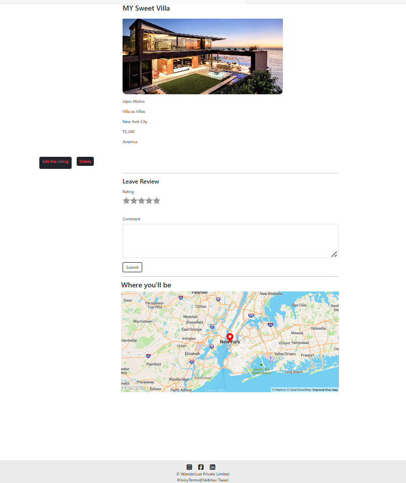
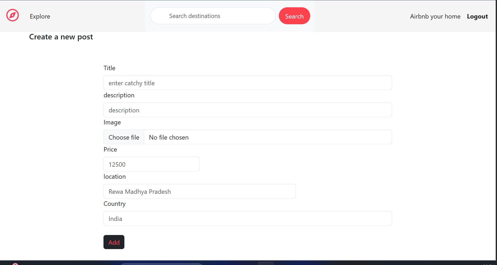

# 🌍 WanderLust

WanderLust is a full-stack web application inspired by Airbnb.  
Users can explore travel listings, create their own listings, upload images, and share reviews with proper authentication and authorization.

This project is built to practice real-world backend concepts like RESTful routing, authentication, authorization, and database relationships.

---

## 🚀 Features

- User Authentication (Register / Login / Logout)
- Create, edit, and delete listings
- Search functionality to find listings by country, location, or title
- Interactive map integration displaying listing locations with markers
- Upload images for listings
- Add and delete reviews
- Flash messages for success & error handling
- Authorization:
  - Only listing owners can edit/delete listings
  - Only review authors can delete their reviews

---

## 🛠️ Tech Stack

### Frontend
- HTML
- CSS
- Bootstrap
- EJS (Embedded JavaScript Templates)

### Backend
- Node.js
- Express.js

### Database
- MongoDB
- Mongoose

### Authentication & Security
- Passport.js
- Express-session
- Connect-mongo
- Method-override

---

## 📂 Project Structure

Major-Project/
│
├── models/
│ ├── listing.js
│ ├── review.js
│ └── user.js
│
├── routes/
│ ├── listing.js
│ ├── review.js
│ └── user.js
│
├── views/
│ ├── layouts/
│ ├── listings/
│ ├── users/
│ └── includes/
│
├── public/
│ ├── css/
│ └── js/
│
├── utils/
│ └── ExpressError.js
│
├── app.js
├── package.json
└── README.md


---

## ⚙️ Installation & Setup

### 1️⃣ Clone the Repository
```bash
git clone https://github.com/vkt99163/Wanderlust.git
```

2️⃣ Install Dependencies
```npm install```


3️⃣ Environment Variables

Create a .env file in the root directory and add:

```MONGO_URI=your_mongodb_connection_string
SESSION_SECRET=your_secret_key
```

4️⃣ Run the Application
```nodemon app.js```

5️⃣ Open in Browser
```
http://localhost:8080
```

##  Authorization Logic Explained

- Users must be logged in to create listings or reviews

- Only the owner of a listing can edit or delete it

- Only the author of a review can delete that review

- Unauthorized actions are blocked with flash messages

## 📸 Screenshots

### Home Page


### Search Functionality


### Listing with Map Integration


### Add New Listing



🌱 Future Enhancements

Booking functionality

User profile dashboard

👨‍💻 Author

Vaibhav Tiwari
Full Stack Web Development Learner 


